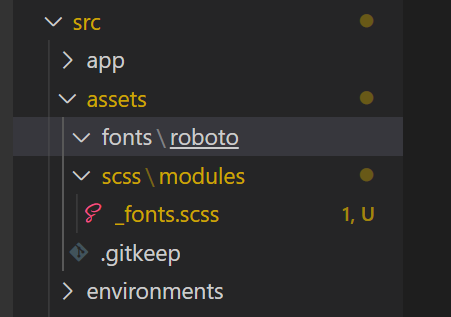
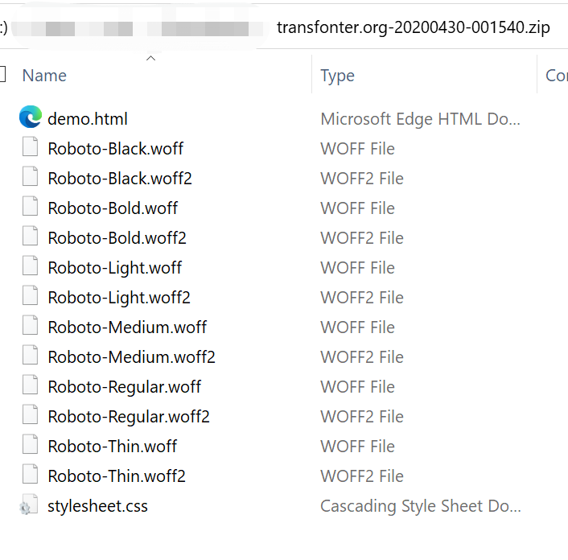
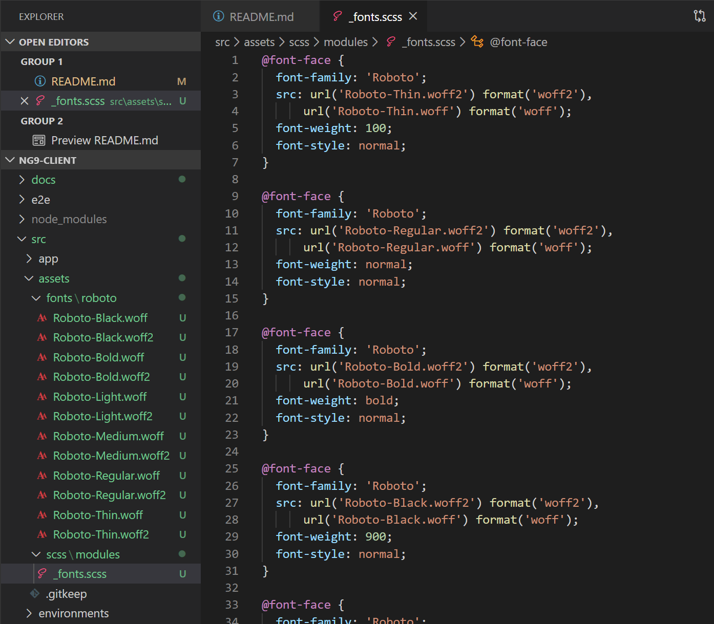
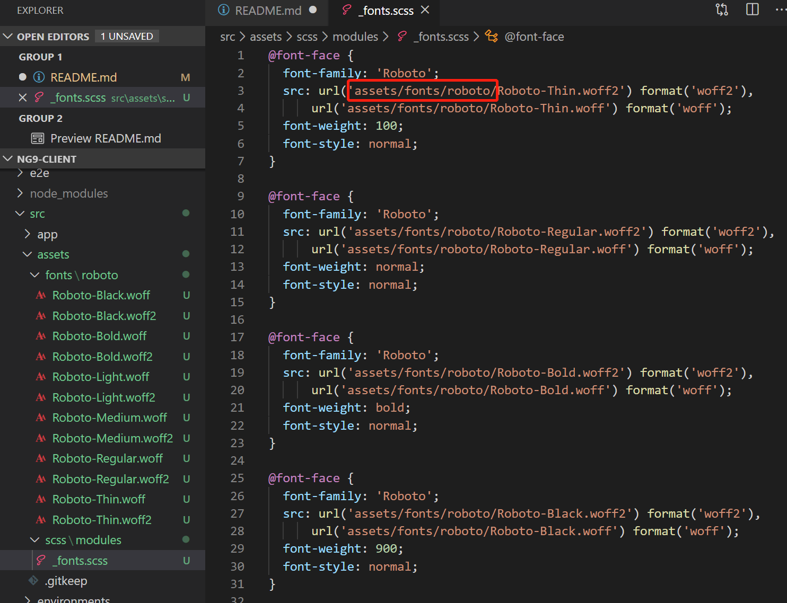
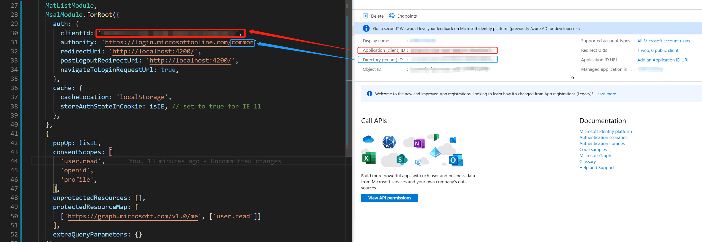
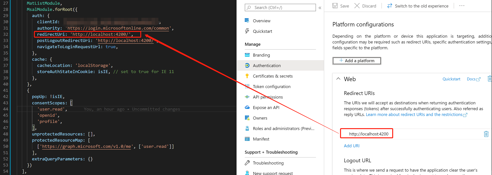
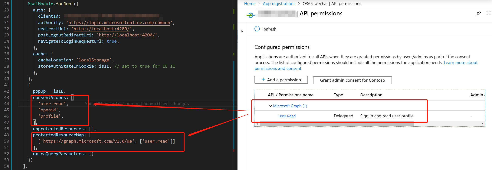

# Ng9Client

This project was generated with [Angular CLI](https://github.com/angular/angular-cli) version 9.1.3.

## Development server

Run `ng serve` for a dev server. Navigate to `http://localhost:4200/`. The app will automatically reload if you change any of the source files.

## Step 1: Init a new Angular 9 project
> Use `Angular CLI` to init a new Angular 9 client, select enable `route` and use `scss`
```
ng new ng9-client
```

## Step 2: Install Angular Material
>1. Use `ng add` to install Angular Material
>2. Choose the prebuild theme `Deep Purple/Amber`
>3. Set up global Angular Material typography styles `N`
>4. Set up brower animations for Angular Material `Y`
```
ng add @angular/material
```

## Step 3: Host the font in local

### Step 3.1: Use Google Roboto font
>1. Download the Google Roboto font
>2. Create the font folder `roboto` in `src/assets/fonts`
>3. Create a file `_fonts.scss` in `src/assets/scss/modules` where we'll declare the @font-facevalues    
  

### Step 3.2: Use online font tool to generate the @font-face
>1. Open [Transfonter](https://transfonter.org/) site  
>2. Upload the fonts from the downloaded google fonts, use the default setting and download the coverted zip file.  
>3. Unzip the file and extract the `.woff` and `.woff2` for all the fonts and copy these files to `src/assets/fonts/roboto`  

>4. Copy the code from `stylesheet.css` to `src/assets/scss/modules/_font.scss`

>5. Change the font url to current correct url in `_font.scss`


### Step 3.3: Use the font in the angular project
>1. import the `_font.scss` file in the main stylesheet of the angular application `style.scss`

# Step 4: Add two simple component and set the route
> We will create two simple components, and use route to navigate through these two components.  
>1. Create `Home` Component
>2. Create `Profile` Component
>3. Add the route config in `app-routing.module.ts`
>4. Add route outlet in the app html template `app.component.html`, to navigate between the `Home` and `Profile` component.

# Step 5: Use angular material
>1. Import `MatToolbarModule`, `MatButtonModule`, `MatListModule` in `app.module.ts`
>2. Change the application main template `app.component.html`, and use angular material to set the layout.

# Step 6: Use MSAL library to login and logout
>1. Install MSAL libraries
>   ```
>   npm install --save @azure/msal-angular msal
>   ```

>2. Import MSAL modules in `app.module.ts`
>   ```javascript
>     const isIE = window.navigator.userAgent.indexOf('MSIE ') > -1 || window.navigator.userAgent.indexOf('Trident/') > -1;
>
>     ...
>
>     MsalModule.forRoot({
>      auth: {
>          clientId: '00000000-0000-0000-0000-00000000',
>          authority: 'https://login.microsoftonline.com/common',
>          redirectUri: 'http://localhost:4200/',
>          postLogoutRedirectUri: 'http://localhost:4200/',
>          navigateToLoginRequestUrl: true,
>        },
>        cache: {
>          cacheLocation: 'localStorage',
>          storeAuthStateInCookie: isIE, // set to true for IE 11
>        },
>      },
>      {
>        popUp: !isIE,
>        consentScopes: [
>          'user.read',
>          'openid',
>          'profile',
>        ],
>        unprotectedResources: [],
>        protectedResourceMap: [
>          ['https://graph.microsoft.com/v1.0/me', ['user.read']]
>        ],
>        extraQueryParameters: {}
>      })
>    ],
>    providers: [
>      {
>        provide: HTTP_INTERCEPTORS,
>        useClass: MsalInterceptor,
>        multi: true
>      }
>    ],
>   ```

> <b>Tips:</b>  
> MSAL informations can be found in Azure `App registrations`, you can refer this [blog](https://docs.microsoft.com/en-us/azure/active-directory/develop/quickstart-register-app) on how to register an App.
> 
> 
> 

>3. Add the login and logout functions to the project


# References
- [Import fonts in an Angular App — THE EASY / RIGHT WAY!](https://medium.com/@aditya_tyagi/import-fonts-in-an-angular-app-the-easy-right-way-ae9e99cab551)
- [Tutorial: Sign in users and call the Microsoft Graph API from an Angular single-page application](https://docs.microsoft.com/en-us/azure/active-directory/develop/tutorial-v2-angular)
- [Microsoft Authentication Library for Angular](https://www.npmjs.com/package/@azure/msal-angular)